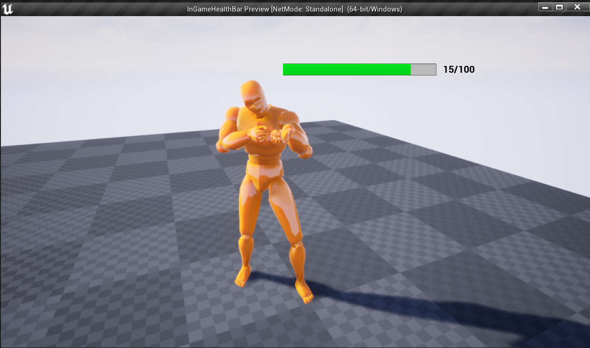

# UI Programming: In-game Health Bar using C++ & UMG
**Engine -** UE4
## Workflow
- Created an actor class and added parameters - Health, MaxHealth, HealthWidgetComp etc
- Created getters & setters for Health & MaxHealth
- Randomly changed health in the tick function
- Created a UserWidget class and added paramters such as Health_Bar, CurrentHealthLabel, etc
- Used a weak object ptr to get reference to the owner actor class
- Set the percent of the Health_Bar and the text of CurrentHealthLabel etc using the getters of the actor class
- In the actor class intialized the UserWidget class and assigned value to its weak object ptr
- Created Child blueprint class of the UserWidget class and added the corresponding components in the viewport
- Created Child blueprint class of the actor class and set the HealthWidgetComp class and made changes to it's parameters such as transformation, space, pivot etc.
- Added a skeletal mesh to the actor class
## Output
 

